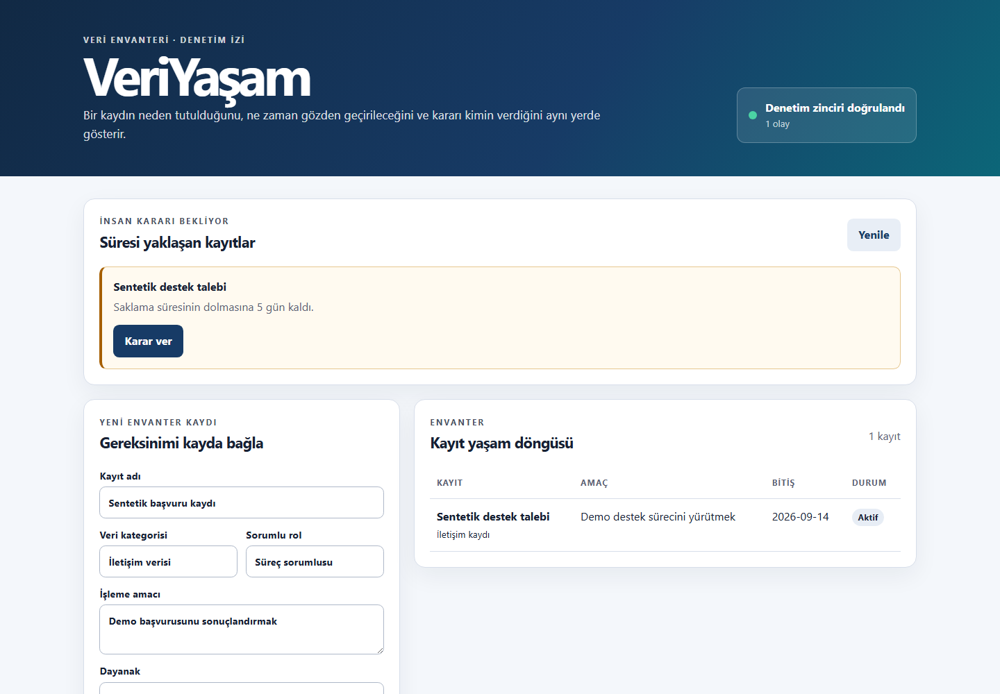

# VeriYaşam

[English summary](README.en.md)

VeriYaşam, bir kurumun tuttuğu veri kayıtlarını amaç, dayanak, konum, sorumlu rol ve saklama süresiyle birlikte izleyen açık kaynak bir demonstrasyondur. Süresi dolan kayıtları kendiliğinden yok etmez; saklama, anonimleştirme veya silme kararını gerekçesiyle birlikte bir insana bırakır ve sonucu hash zincirli denetim günlüğüne yazar.

Bu proje bir hukuk veya KVKK uyum ürünü değildir. Veri yaşam döngüsünün çalışan koda, yetki kontrolüne ve kabul testine nasıl bağlanabileceğini gösteren eğitim amaçlı bir portföy çalışmasıdır.

## Neyi gösteriyor?

- Amaç ve saklama süresiyle ilişkilendirilmiş veri envanteri
- Viewer, data steward ve admin rollerinden oluşan küçük bir yetki matrisi
- Süresi geçen veya yedi gün içinde dolacak kayıtların hesaplanması
- İnsan gerekçesi olmadan kesinleşmeyen sakla, anonimleştir ve sil kararları
- Silme demonstrasyonunda doğrudan fiziksel silme yerine geri döndürülebilir durum değişimi
- Önceki olayın özetini taşıyan SHA-256 hash zincirli denetim kaydı
- Zincir bozulmasını tespit eden doğrulama uç noktası
- Sentetik başlangıç verisi ve erişilebilir, responsive web arayüzü
- Leap year, yetki, yaşam döngüsü ve kayıt tahrifi senaryolarını kapsayan testler

## Hızlı başlangıç

Python 3.11 veya üzeri gerekir.

    python -m venv .venv
    .venv\Scripts\activate
    pip install -r requirements-dev.txt
    uvicorn app.main:app --reload

Tarayıcıdan http://127.0.0.1:8000 adresini açın. API belgesi http://127.0.0.1:8000/docs adresindedir.

Testler:

    pytest

Docker:

    docker build -t veri-yasam .
    docker run --rm -p 8000:8000 veri-yasam

## Ana akış

1. Veri sorumlusu kaydın kategorisini, amacını, dayanağını, konumunu ve saklama süresini tanımlar.
2. Sistem bitiş tarihini deterministik kuralla hesaplar.
3. Süre yaklaşınca kayıt karar kuyruğuna girer.
4. Yetkili insan saklama, anonimleştirme veya silme kararını ve gerekçesini yazar.
5. Karar, önceki olayın hash değerine bağlı yeni bir denetim olayı üretir.
6. Admin zincirin bütünlüğünü doğrulayabilir.

## Mimari

    Web arayüzü
          |
       FastAPI ---- Rol kontrolü
          |
    Yaşam döngüsü motoru
          |
       SQLite ---- Karar kayıtları
          |
    Hash zincirli denetim izi

Ayrıntılar için [mimari notu](docs/architecture.md), [gereksinimler](docs/requirements.md) ve [yerel test raporu](docs/test-report.md) dosyalarına bakın.

## Demo roller

Arayüz demonstrasyon amacıyla X-Demo-Role başlığında admin rolünü kullanır. Bu, gerçek bir kimlik doğrulama mekanizması değildir. API üzerinde varsayılan rol viewer olup veri değiştiremez.

| Rol | Okuma | Kayıt ekleme | Karar verme | Zincir doğrulama |
|---|---:|---:|---:|---:|
| viewer | Evet | Hayır | Hayır | Hayır |
| data_steward | Evet | Evet | Evet | Hayır |
| admin | Evet | Evet | Evet | Evet |

## Kabul ölçütleri

- Saklama süresi toplam gün sayısıyla ve tarih sınırlarında doğru hesaplanır.
- Süresi dolan kayıt otomatik olarak fiziksel silinmez.
- Karar vermek için yetki, insan kimliği ve en az sekiz karakterlik gerekçe gerekir.
- Anonimleştirme kişi referansını kaldırır.
- Her değişiklik denetim olayı üretir.
- Geçmiş olay değiştirildiğinde zincir doğrulaması başarısız olur.
- Test paketi temiz bir ortamda geçer.

## Güvenlik ve sınırlar

- Depoda yalnızca sentetik demo verisi bulunur.
- Üretimde X-Demo-Role yerine gerçek kimlik doğrulama ve merkezi yetkilendirme gerekir.
- Hash zinciri değişikliği görünür yapar; yetkili bir veritabanı yöneticisinin tüm zinciri yeniden yazmasını tek başına engellemez.
- SQLite tek örnekli demo içindir. Çok kullanıcılı üretim için ayrı veritabanı, migration, yedekleme ve gözlemlenebilirlik gerekir.
- Hukuki dayanak ve saklama süresi değerleri örnektir; gerçek kullanımda alan uzmanı onayı gerekir.

Güvenlik bildirim süreci için [SECURITY.md](SECURITY.md) dosyasına bakın.

## Yapay zekâ kullanımı

Bu projede çalışma zamanında yapay zekâ yoktur. Üretken yapay zekâ; alternatif tasarımları karşılaştırma, başlangıç kodu, sınır durumları ve dokümantasyon taslağında eşli programlama aracı olarak kullanıldı. Kullanım biçimi ve sınırlar [AI_USAGE.md](AI_USAGE.md) içinde açıkça kayıtlıdır.

## Durum

Sürüm 1.0.0, portföy ve eğitim amaçlı çalışan demonstrasyondur. Üretime hazır olduğu iddia edilmez. Planlanan geliştirmeler arasında OpenID Connect, PostgreSQL, migration sistemi ve zamanlanmış gözden geçirme bildirimleri vardır.

## Lisans

MIT — ayrıntılar [LICENSE](LICENSE) dosyasındadır.
